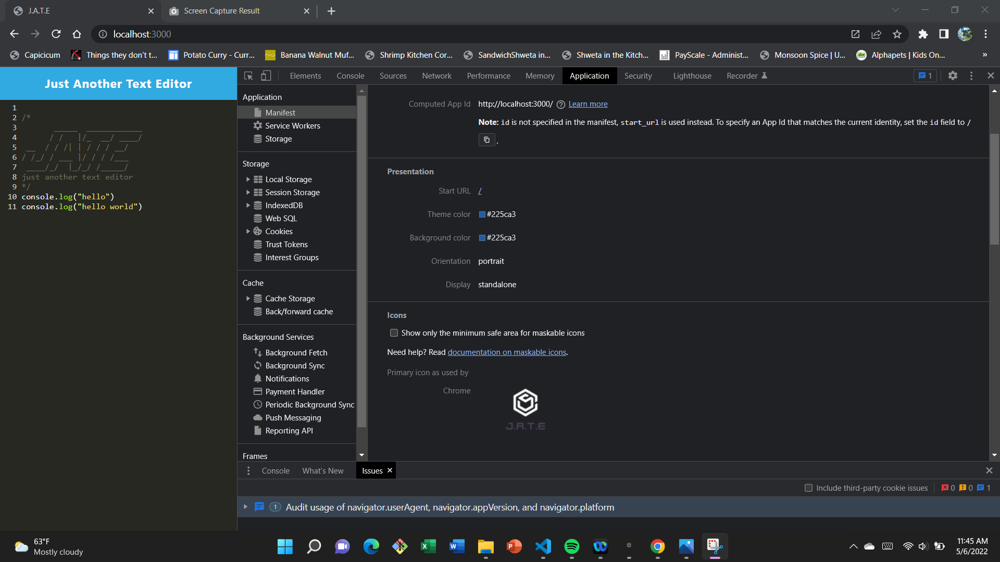
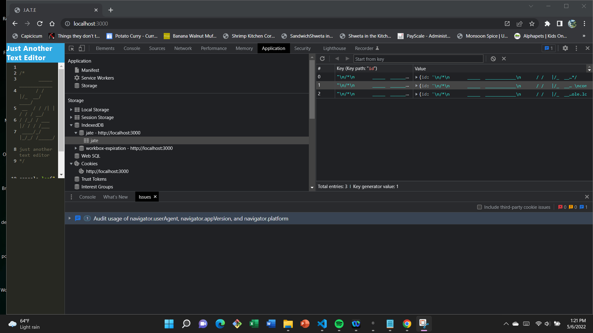

# Progressive Web Application: Text-pad

## Description
Created a simple text editor app that can function both online and offline. Needed to use a variety of data persistence options in order to ensure that data is not lost in any scenario. The application first looks to use the data in the indexedDB to populate the editor, then if it cannot access that it will use local storage. For use offline, this application can be downloaded to your desktop as an application. This application is helpful to developers because they can use this as a scratch pad for code snippets and coding ideas. 

## User Story
```md
AS A developer
I WANT to create notes or code snippets with or without an internet connection
SO THAT I can reliably retrieve them for later use
```
 
## Installation
to install the dependencies for this project, the user simply needs to clone the repository and then run the command "npm install". This will install all necessary dependencies since they are all included in the package.json.

## Usage
To use this app, simply open it up in the browser (with the deployed app link at the top of this readme) and then you are good to go. For offline use, the user can go to the link and hit the "install" button at the top left corner of the page.

## Mock-Up

The following animation demonstrates the application functionality:


The following image shows the application's `manifest.json` file:



The following image shows the application's registered service worker:


The following image shows the application's IndexedDB storage:




## Review

You are required to submit the following for review:

* [The URL of the deployed application]()

* [The URL of the GitHub repository, with a unique name and a README describing the project](https://github.com/PROGRAMER122223/Text-pad.git)